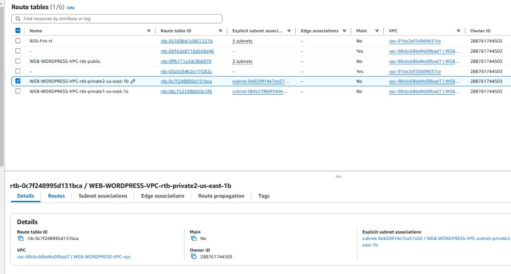
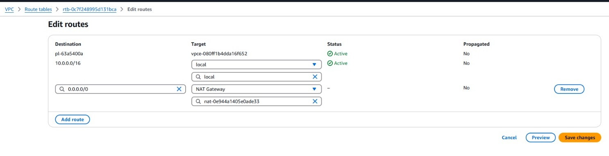

# Docker e AWS - Wordpress.

<p align="center">
  
</p>
Esse projeto de forma geral fará uso de EC2s(Elastic Compute Clouding), Amazon RDS, Load Balancer, Auto Scaling.

---

[Arquitetura](https://github.com/Yyfii/Docker-AWS-Wordpress/tree/main?tab=readme-ov-file#arquitetura)
<br>

[Passo 1: Criando uma VPC.](https://github.com/Yyfii/Docker-AWS-Wordpress/tree/main?tab=readme-ov-file#passo-1-criando-uma-vpc)
<br>

[Passo 2: Criando os Security groups.](https://github.com/Yyfii/Docker-AWS-Wordpress/tree/main?tab=readme-ov-file#passo-2-criando-os-security-groups)
<br>

[Passo 3: Criando o RDS.](https://github.com/Yyfii/Docker-AWS-Wordpress/tree/main?tab=readme-ov-file#passo-3-criando-o-rds)
<br>

[Passo 4: Criando o EFS.](https://github.com/Yyfii/Docker-AWS-Wordpress/tree/main?tab=readme-ov-file#passo-4-criando-o-efs)
<br>

[Passo 5: Criando e configurando o Nat Gateway.](https://github.com/Yyfii/Docker-AWS-Wordpress/tree/main?tab=readme-ov-file#passo-5-criando-e-configurando-o-nat-gateway)
<br>

[Passo 6: Organizando os endpoints no script user data.](https://github.com/Yyfii/Docker-AWS-Wordpress/tree/main?tab=readme-ov-file#passo-6-organizando-os-endpoints-no-script-user-data)
<br>

[Passo 7: Criando um Bastion Host.](https://github.com/Yyfii/Docker-AWS-Wordpress/tree/main?tab=readme-ov-file#passo-7-criando-um-bastion-host)
<br>

[Passo 8: Criando um launch template.](https://github.com/Yyfii/Docker-AWS-Wordpress/tree/main?tab=readme-ov-file#passo-8-criando-um-launch-template)
<br>

[Passo 9: Criando instancias.](https://github.com/Yyfii/Docker-AWS-Wordpress/tree/main?tab=readme-ov-file#passo-9-criando-instancias)
<br>

[Passo 10: Criando um Load Balancer.](https://github.com/Yyfii/Docker-AWS-Wordpress/tree/main?tab=readme-ov-file#passo-10-criando-um-load-balancer)
<br>

[Passo 11: Finalmente! Criando um auto scaling group e testando a nossa aplicação final.](https://github.com/Yyfii/Docker-AWS-Wordpress/tree/main?tab=readme-ov-file#passo-11-finalmente-criando-um-auto-scaling-group-e-testando-a-nossa-aplica%C3%A7%C3%A3o-final)
<br>

---

## Arquitetura

<p align="center">
  
</p>

## Passo 1: Criando uma VPC.

No seu AWS Console, busque por VPC, em seguida clique em criar VPC.

| **Nome**          | **Especificações**              |
| ----------------- | ------------------------------- |
| WEB-WORDPRESS-VPC | 2 AZ (Zonas de Disponibilidade) |
|                   | 3 subnets públicas              |
|                   | 2 subnets privadas              |

|  |
| :---------------------------: |

## Passo 2: Criando os Security groups.

Agora iremos criar os **Security Groups(SG)**, iremos criar dois SG, um público, que será usado pelo Load Balancer e o Bastion Host. E um privado, que será usado, pelas instancias EC2, RDS e todos os resources que exigem níveis de seguranaça.

<table>
  <tr>
    <td style="text-align: center;">
      
    </td>
  </tr>
</table>

Vá para:

##### `VPC > Security Groups > Criar Security Group`

- Especificações:

| **Nome**                 | **VPC**               | **Inbound Rules**                                                                                                                                                                                                               |
| ------------------------ | --------------------- | ------------------------------------------------------------------------------------------------------------------------------------------------------------------------------------------------------------------------------- |
| WEB-WORDPRESS-PRIVATE-SG | WEB-WORDPRESS-VPC-vpc | - **Mysql/Aurora**: 3306 - 0.0.0.0/0 <br> - **HTTPS**: 444 - WEB-WORDPRESS-PUBLIC-SG <br> - **HTTP**: 80 - WEB-WORDPRESS-PUBLIC-SG <br> - **SSH**: 22 - WEB-WORDPRESS-PUBLIC-SG <br> - **HTTPS**: 443 - WEB-WORDPRESS-PUBLIC-SG |

Após ter criado os security groups, vá no **WEB-WORDPRESS-PRIVATE-SG**, em editar regras de entrada, e adicione a seguinte regra:

- NFS - Source: WEB-WORDPRESS-PRIVATE-SG

| **Nome**                 | **VPC**               | **Inbound Rules**                                                                                                                                                                                                                                                               |
| ------------------------ | --------------------- | ------------------------------------------------------------------------------------------------------------------------------------------------------------------------------------------------------------------------------------------------------------------------------- |
| WEB-WORDPRESS-PRIVATE-SG | WEB-WORDPRESS-VPC-vpc | - **NFS**: 2049 - WEB-WORDPRESS-PRIVATE-SG <br> - **Mysql/Aurora**: 3306 - 0.0.0.0/0 <br> - **HTTPS**: 444 - WEB-WORDPRESS-PUBLIC-SG <br> - **HTTP**: 80 - WEB-WORDPRESS-PUBLIC-SG <br> - **SSH**: 22 - WEB-WORDPRESS-PUBLIC-SG <br> - **HTTPS**: 443 - WEB-WORDPRESS-PUBLIC-SG |

## Passo 3: Criando o RDS.

##### `RDS > Criar database`

- **Especificações:**

| **..**                     | **..**                            |
| -------------------------- | --------------------------------- |
| **Nome**                   | WEB-WORDPRESS-RDS                 |
| **Tipo de Banco de Dados** | MYSQL                             |
| **Plano**                  | FreeTier                          |
| **Nome do Banco de Dados** | wordpress                         |
| **Autenticação**           | Admin - MyNewPass1                |
| **Tipo de Instância**      | db.t3.micro                       |
| **Conexão com EC2**        | Não conectado                     |
| **VPC**                    | WEB-WORDPRESS-VPC-vpc             |
| **Security Group**         | WEB-WORDPRESS-PRIVATE-SG          |
| **Configuração Adicional** | Banco de dados inicial: wordpress |

- ###### Criar banco.

## Passo 4: Criando o EFS.

##### `EFS > Criar File System`

- **Especificações:**

| **..**   | **..**                |
| -------- | --------------------- |
| **Nome** | WEB-WORDPRESS-EFS     |
| **VPC**  | WEB-WORDPRESS-VPC-vpc |

- ###### Criar.

Clique no **file system** criado, na seção de Network clique em manage e mude os security groups para o **WEB-WORDPRESS-PRIVATE1-SG**.

|  |
| :--------------------------------: |

## Passo 5: Criando e configurando o Nat Gateway.

O **Nat Gateway** vai permitir a conexão das instancias privadas com a internet.

##### `VPC > Nat Gateways > Criar Nat Gateway`

- **Especificações:**

| **..**                    | **..**                                      |
| ------------------------- | ------------------------------------------- |
| **Nome**                  | WEB-WORDPRESS-NAT-GATEWAY                   |
| **Subnet**                | WEB-WORDPRESS-VPC-subnet-public1-us-east-1a |
| **Tipo de Conectividade** | Publica                                     |
| **Ação**                  | Clicar em Alocar IP Elastico                |
| **VPC**                   | WEB-WORDPRESS-VPC-vpc                       |

|  |
| :-----------------------------------: |

- ###### Criar.

Agora iremos associar o nat gateway às subnets privadas através da route table.

##### `VPC > Route tables`

- **Na subnet**: WEB-WORDPRESS-VPC-rtb-private1-us-east-1a:

  - Clique na subnet e vá na seção **Routes**.
    
  - Edite as rotas, clique em **Nova Rota**, e coloque `0.0.0.0/0` como destino e **Nat Gateway** como target, em seguida selecione o NAT Gateway criado anteriormente.
    

- **Na subnet**: WEB-WORDPRESS-VPC-rtb-private2-us-east-1b, faça o mesmo processo.

## Passo 6: Organizando os endpoints no script user data.

No nosso user data usamos dois endpoints, um do RDS e outro do EFS.

- Copie o **user data** abaixo e colo em um editor de código, ou qualquer outro editor de texto.

- Vá no seu **RDS** criado, clique nele, e na seção Conectivade e segurança, copie o endpoint.
- No user data que está no seu editor de texto, vá no `<ENDPOINT RDS>` e substitua pelo **endpoint** do RDS.

- Vá no **EFS** criado, clique nele, clique em `Attach/anexar`, e copie o comando abaixo de `Usando o client NFS`.
- No user data procure a linha que inicia com `sudo mount -t nfs4`, substitua-a pelo comando que você copiou. E no final do comando onde tiver `:/ efs`, substitiua por `:/ /mnt/efs`.

```sh
#!/bin/bash

# Atualiza os pacotes da maquina
yum update -y

# Instala o git e o docker
yum install git docker amazon-efs-utils  -y
# Inicia o docker e instala o docker compose
systemctl enable docker
systemctl start docker
sudo curl -L "https://github.com/docker/compose/releases/latest/download/docker-compose-$(uname -s)-$(uname -m)" -o /usr/local/bin/docker-compose
sudo chmod +x /usr/local/bin/docker-compose

# Cria uma pasta no diretório raiz, para que o compose.yml não fique nos arquivos temporarios

mkdir -p  /files

# Cria um arquivo compose.yml na pasta files
cat <<EOF> /files/compose.yml
services:
  wordpress:
    image: wordpress
    restart: always
    ports:
      - 80:80
    environment:
      WORDPRESS_DB_HOST: <ENDPOINT RDS>:3306
      WORDPRESS_DB_USER: admin
      WORDPRESS_DB_PASSWORD: MyNewPass1
      WORDPRESS_DB_NAME: wordpress
    volumes:
      - /mnt/efs:/var/www/html
EOF

sudo mkdir -p /mnt/efs

sudo mount -t nfs4 -o nfsvers=4.1,rsize=1048576,wsize=1048576,hard,timeo=600,retrans=2,noresvport fs-05cf370359e4902e5.efs.us-east-1.amazonaws.com:/ /mnt/efs


sudo docker-compose -f /files/compose.yml up -d

```

Verifique todos os seus endpoints antes de prosseguir.

## Passo 7: Criando um Bastion Host.

Por questões de segurança, criamos uma máquina que possa acessar as nossas instancias privadas, e também para testar o nosso script user data.

##### `EC2 > Instancias > Launch Instances`

- Especificações:

| **..**                           | **..**                                   |
| -------------------------------- | ---------------------------------------- |
| **Nome**                         | WEB-WORDPRESS-BASTION-HOST               |
| **Key pair**                     | pbnov24                                  |
| **Editar configurações de rede** | WEB-WORDPRESS-VPC                        |
| **Subnet**                       | subnet-public1-us-east-1a                |
| **Habilitar IP Público**         | Sim                                      |
| **Selecionar SG**                | WEB-WORDPRESS-PUBLIC-SG                  |
| **Detalhes avançados**           | User data: Cole o seu user data no campo |

- ###### Launch Instance.

Espere a instancia ficar com o **status checked**.

Clique na instancia, Copie o **IP Público** dela e cole no seu navegador.

Ela pode demorar um pouco pra carregar por conta de ainda estar iniciando o container. Então enquanto ela carrega você pode seguir para o próximo passo.

Ela deve mostrar a página inicial do Wordpress.

|  |
| :-------------------------: |

## Passo 8: Criando um launch template.

##### `Instancias > Launch Templates > Launch Instances > Criar template`

- Especificações:

  | **Especificação**      | **Valor**                                |
  | ---------------------- | ---------------------------------------- |
  | **Nome**               | WEB-WORDPRESS-SERVERS                    |
  | **Quick start**        | Amazon Linux                             |
  | **Tipo de instância**  | t2.micro                                 |
  | **Key pair**           | pbnov24                                  |
  | **Subnet**             | Não selecione a subnet                   |
  | **Selecionar SG**      | WEB-WORDPRESS-PRIVATE-SG                 |
  | **Detalhes avançados** | User data: Cole o seu user data no campo |

  - ###### Launch Instance.

## Passo 9: Criando instancias.

##### `Instancias > Launch Instance.Launch Instance from template`

Selecione o template criado.

- Especificações:
  | **..** | **..** |
  |------------------------------------|--------------------------------------------------------|
  | **Subnet** | WEB-WORDPESS-VPC-subnet-private1-us-east-1a |

**Cheque se todos os campos estão corretos, principalmente o SG e o user data.**

- ###### Launch Instance.

Agora iremos verificar se a instancia está correta, acessando-a pelo **Bastion Host**.

|  |
| :----------------------------------: |

Clique em conect, e ele irá abrir dentro do BastionHost.

Iremos agora fazer o acesso ssh da instancia privada.

Abra a sua keypair utilizada na instancia e cole no arquivo **pbnov24** aberto pelo nano, `Ctrl + o` e Enter e depois `Ctrl + x` para sair.
Copie o Ip privado da instancia criada.
` sudo ssh -i "pbnov24" ec2-user@<ip privado da instancia>`

|  |
| :----------------------------: |

Siga os comonados da imagem acima.

```bash
cd .ssh
nano pbnov24 #cole o conteúdo da sua keypair
ls
sudo ssh -i "pbnov24" ec2-user@<ip privado da instancia>
```

|  |
| :---------------------------------: |

Siga os comonados da imagem acima.

```bash
sudo docker ps
cd /mnt
df -h
```

Observe se o seu mount está correto. Se o seu Bastion Host está mostrando o wordpress e o seu mount está mostrando o link do efs amazon, então agora nos resta apenas criar um Load Balancer e o Auto Scaling.

## Passo 10: Criando um Load Balancer.

##### `Load Balancers > Criar Load Balancer`

Procure por Classic Load Balancer e clique em criar.

| **Nome**          | **Especificações**                                                                                                                                                                                           |
| ----------------- | ------------------------------------------------------------------------------------------------------------------------------------------------------------------------------------------------------------ |
| WEB-WORDPRESS-CLB | - **Internet-facing** <br> - **Network mapping**: WEB-WORDPRESS-VPC, Selecione as duas AZ e coloque a subnet pública <br> - **SG**: WEB-WORDPRESS-PUBLIC-SG <br> - **Healthy checks**: /wp-admin/install.php |

- ###### Criar.

- Agora crie outra instancia usando o template WEB-WORDPRESS-SERVERS para testarmos o Load Balancer.

|  |
| :--------------------------------: |

- Neste mommento o que nos resta é associar as instancias criadas para verificar se o Load Balancer está de fato funcionando.

##### `Load Balancers > WEB-WORDPRESS-CLB > Seção no LB de Target Instances > Manage Instances`

- Vá para a seção de target Instances, Manage Instances.

|  |
| :--------------------------------------: |

- Agora na target Instances, verifique se o Healthy status das instancias está In-Service.

Copie e acesse o DNS do load balancer no seu navegador.

|  |
| :-------------------------------: |

    Já que o nosso Load Balancer está rodando, iremos dar inicio a criação do Auto Scaling.

<table>
  <tr>
    <td style="text-align: center;">
    Até agora temos:
    <br>
      
    </td>
  </tr>
</table>

## Passo 11: Finalmente! Criando um auto scaling group e testando a nossa aplicação final.

##### `Auto Scaling groups> Criar Auto Scaling group >`

| **Nome**          | **Especificações**                                                                                                                                                                                                                                                                                                                                                                                                                                                                                                                                                |
| ----------------- | ----------------------------------------------------------------------------------------------------------------------------------------------------------------------------------------------------------------------------------------------------------------------------------------------------------------------------------------------------------------------------------------------------------------------------------------------------------------------------------------------------------------------------------------------------------------- |
| WEB-WORDPRESS-ASG | - **Selecione o Launch template**: WEB-WORDPRESS-SERVERS <br> - **VPC**: WEB-WORDPRESS-VPC <br> - **Selecione as subnets**: privadas <br> - **Anexar a um Load Balancer existente**: WEB-WORDPRESS-CLB <br> - **Habilitar ELB health checks** <br> - **Group size**: Capacidade desejada (2), Min(1), Max(2) <br> - **Target tracking scaling policy**: Average CPU utilization (target - 70, 200s) <br> - **Terminate and Launch** <br> - **Enable group metrics collection within CloudWatch** <br> - **Add Notification**: Ex: my-sns-topic(seuemail@gmai.com) |

- ###### Criar.

  Vá no link DNS aberto do Load balancer e faça o refresh ou recarregue com F5. Se você for nas suas instancias, o número delas deve ter aumentado.


    Agora, a estrutura do nosso projeto

<table>
  <tr>
    <td style="text-align: center;">
          
    </td>
  </tr>
</table>

    Testando em um dispositivo de outra rede e na minha própria rede.


Portanto temos agora a nossa aplicação funcionando e completa.
