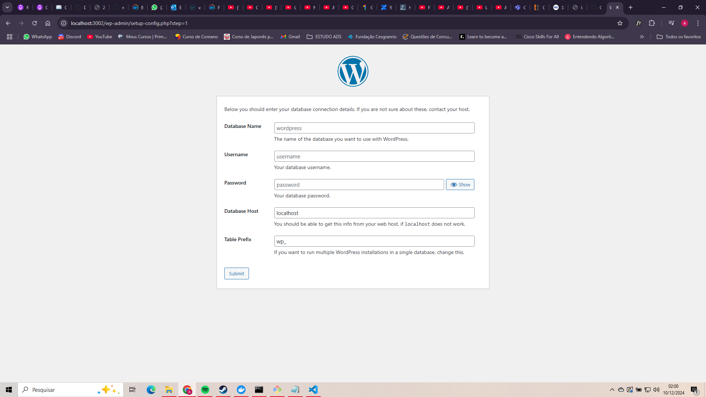

# Docker e AWS - Wordpress.

- Esse projeto de forma geral fará uso de EC2s(Elastic Compute Clouding), Amazon RDS, Load Balancer.

## Construindo um Container Wordpress

Siga os babies steps abaixo:

## Passo 1: Testando o worpress localmente:

1. Baixar a imagem (pode ser baixada durante a )
   No link official da image : pull wordpress, mas por questões de eficiencia, podemos fazer o pull da imagem diretamente no run.

`> docker run -d -p 3002:80 --name 
wordpress_app_v2 wordpress`

- Esse comando está criando um container que está rodando em modo detached(no background), ou seja ele não vai ficar executando no terminal. `-p 3002:80`, a 3002 indica a porta que está sendo exposta no host para acessar a aplicação wordpress que está sendo exposta na porta 80(porta padrão da web).
- Agora no browser: localhost:3002, é possível acessar a aplicação wordpress.

O Wordpress por padrão deve receber as informações de um banco de dados para que ele possa realizar consultas. O que configuraremos em breve.



## Passo 2: Testando o wordpress com o banco.

No site oficial: https://hub.docker.com/_/wordpress
Tem um exemplo docker-compose.yml, copie e crie um arquivo .yml no seu diretório.

- compose.yml

```
services:

  wordpress:
    image: wordpress
    restart: always
    ports:
      - 8080:80
    environment:
      WORDPRESS_DB_HOST: rds
      WORDPRESS_DB_USER: mainUser
      WORDPRESS_DB_PASSWORD: mainPassword
      WORDPRESS_DB_NAME: website
      - wordpress:/var/www/html
  rds:
    image: mysql:5.7
    restart: always
    environment:
      MYSQL_DATABASE: website
      MYSQL_USER: mainUser
      MYSQL_PASSWORD: mainPassword
      MYSQL_RANDOM_ROOT_PASSWORD: "1"
    volumes:
      - rds:/var/lib/mysql

volumes:
  wordpress:
  rds:

```

```
>docker compose up
```

Isso vai criar dois containers, um para o wordpress e outro para o mysql.
O nosso objetivo agora é criar uma instancia EC2 que se conecte a esse container mysql.
Now you can go into your browser na porta 8080.
localhost:8080


# EC2 instancia

1. Primeiramente é necessário uma conta AWS.
   Busque por AMI, irá trazer o catalogo

-
