# Docker e AWS - Wordpress.

Esse projeto de forma geral fará uso de EC2s(Elastic Compute Clouding), Amazon RDS, Load Balancer.

##### Passo 1: Testando o worpress localmente

##### Passo 2: Testando o wordpress com o banco

##### Passo 3: Criando uma instancia EC2

##### Passo 4: Deletando uma instância EC2

##### Passo 5: Criando EC2 e User Data script

## Construindo um Container Wordpress

Siga os babies steps abaixo:

## Passo 1: Testando o worpress localmente:

##### 1. Baixar a imagem (pode ser baixada durante a )

No link official da image : pull wordpress, mas por questões de eficiencia, podemos fazer o pull da imagem diretamente no run.

> `> docker run -d -p 3002:80 --name 
wordpress_app_v2 wordpress`

- Esse comando está criando um container que está rodando em modo detached(no background), ou seja ele não vai ficar executando no terminal. `-p 3002:80`, a 3002 indica a porta que está sendo exposta no host para acessar a aplicação wordpress que está sendo exposta na porta 80(porta padrão da web).
- Agora no browser: localhost:3002, é possível acessar a aplicação wordpress.

O Wordpress por padrão deve receber as informações de um banco de dados para que ele possa realizar consultas. O que configuraremos em breve.

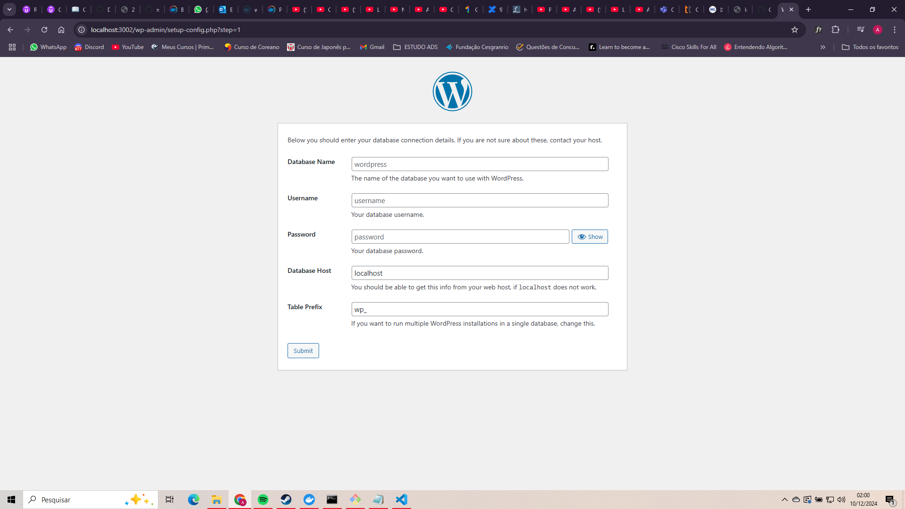

## Passo 2: Testando o wordpress com o banco.

No site oficial: https://hub.docker.com/_/wordpress
Tem um exemplo docker-compose.yml, copie e crie um arquivo .yml no seu diretório.

- compose.yml

```
services:

  wordpress:
    image: wordpress
    restart: always
    ports:
      - 8080:80
    environment:
      WORDPRESS_DB_HOST: rds
      WORDPRESS_DB_USER: mainUser
      WORDPRESS_DB_PASSWORD: mainPassword
      WORDPRESS_DB_NAME: website
      - wordpress:/var/www/html
  rds:
    image: mysql:5.7
    restart: always
    environment:
      MYSQL_DATABASE: website
      MYSQL_USER: mainUser
      MYSQL_PASSWORD: mainPassword
      MYSQL_RANDOM_ROOT_PASSWORD: "1"
    volumes:
      - rds:/var/lib/mysql

volumes:
  wordpress:
  rds:

```

> docker-compose up

Isso vai criar dois containers, um para o wordpress e outro para o mysql.
O nosso objetivo agora é criar uma instancia EC2 que se conecte a esse container mysql.
agora você pode acessar na porta 8080.

> localhost:8080

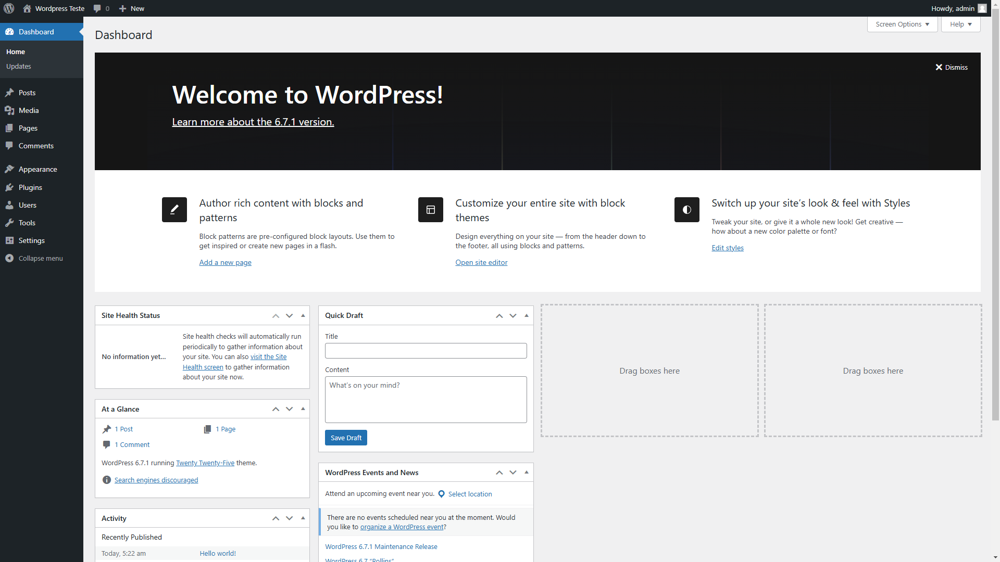

## Passo 3: Criando uma instancia EC2

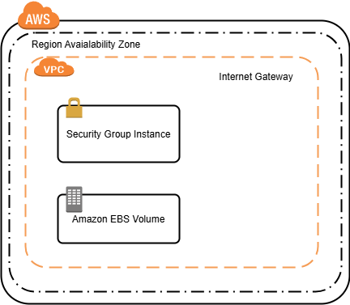

- - EBS(Elastic Block Storage) : Armazenamento persistente.

##### 1. Primeiramente é necessário uma conta AWS.

##### 2. Uma vez, que você conseguiu logar na sua conta. Busque por EC2 (Elastic Compute Clouding).

##### 3. Click em Launch Instances.

3.1 Name -> o nome da sua ec2 - "ec2-wordpress"
3.2 Escolher o OS(sistema operacional da sua ec2), Amazon Linux.
3.3 Key pair: create new pair> RSA > .pem. (\*.pem para mac, linux e windows e .ppk para versões do windows menores que a versão 10) Create pair.

Ele irá automaticamento baixar a keypair, você pode colocá-la na pasta do seu projeto. Ela pode ser usada para acesso ssh(remoto) da sua ec2.

##### 3.4 Network settings > Security Groups > create security group > allow ssh traffic from anywhere 0.0.0.0/0 e allow http traffic from the internet.

3.5 Launch Instance.

Agora você tem uma instancia ec2 criada, clique em cima dela e na parte inferior e mostrará as informações sobre a ec2. Em detalhes busque por ipv4 público, copie-o, pois ele será usado para fazer o acesso remoto via ssh.

Agora no seu diretório do projeto.

Onde sua keypair está presente, abra com uma IDE de escolha, por exemplo estou usando o VSCode. Com o seu diretório aberto no vscode, abra um novo terminal e digite:

> ssh -i video.pem ec2-user@<ip_publico_ec2>

Pontos Importantes: Tenha certeza de que sua keypair esteja no mesmo diretorio em que você se encontre no terminal.

- Se você encontrar o mesmo erro descrito na imagem abaixo:
  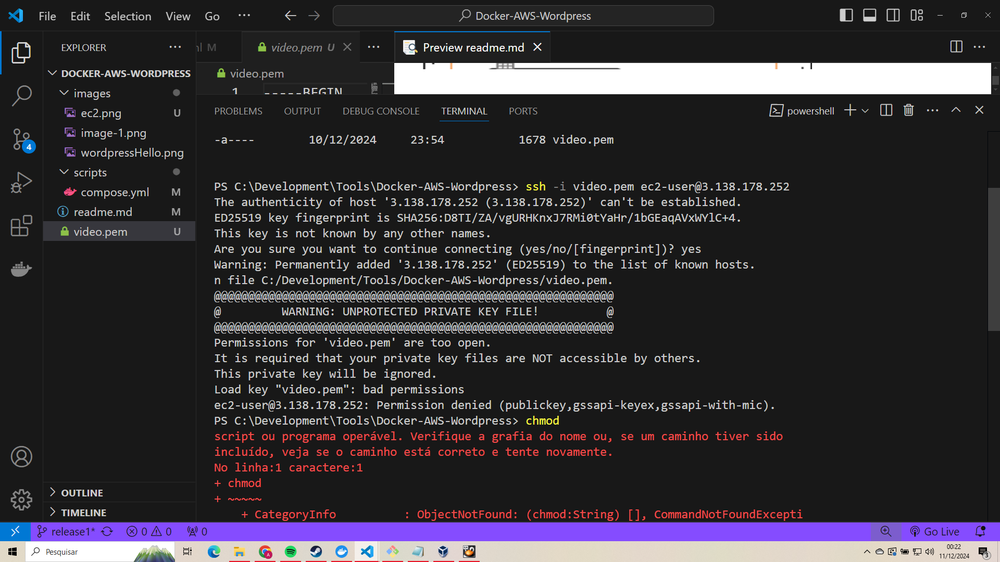

Esse erro ocorre pois esse arquivo não deve ter permissões abertas para todos, já que se trata de uma chave de segurança. Portanto, ele não aceita uma keypair/chave de segurança que não está devidamente protegida, é uma forma de segurança.
Para corrigir o erro:
Vá até a sua pasta no Windows, clique com o botão direito no arquivo video.pem :

###### Conceder acesso> Pessoas específicas> E escolha o proprietário apenas, compartilhe e pronto!

Após isso, o comando deverá rodar novamente.

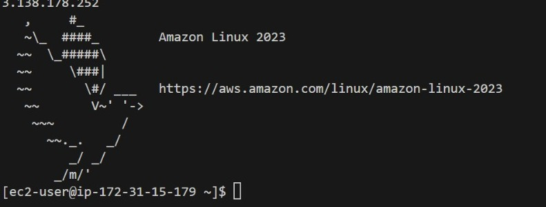

Agora, temos uma instancia EC2 rodando.
Infelizmente devemos deletar a nossa instancia agora, pois ele serviu como um aprendizado para conhecer o processo de criação de uma EC2. Mas, é como dizem "Pods are cattle, not pets", não devemos tratar as nossas instancias como pets, elas devem servir ao nosso objetivo, o qual é o aprendizado.

## Passo 4: Deletando uma instância EC2.

Em instancias, clique na sua instancia.

##### 1. Instancia State > Stop Instance.

##### 2. Espere até que o estado dela passe de stopping para stopped, isso pode levar até 3 minutos.

##### 3. Clique novamente em instance state > Terminate(delete) instance.

Isso pode demorar um pouco, mas não se preocupe.

## Passo 5: Criando EC2 e User Data script.

- User data : é um setup bootstarp para configurar a ec2 durante a primeira launch(execução).

##### EC2 User Data scripts são executados com a User Info

##### 1. Launch Instance

##### 1.2 Keypair : RSA, .pem > Criar par.

##### 1.3 Network Settings.

Nossa instancia vai ter um ip público, com um grupo de segurança(que vai controlar o tráfico da e para a nossa instancia ec2) e podemos adicionar rules(regras).

1. SSH traffic from and HTTP traffic from the internet -> Anywhere (0.0.0.0/0)

##### 1.4 Advanced Details

##### User data

Você pode criar um arquivo.sh e fazer o upload tbm, mas por motivos de aprendizado colocaremos manualmente.

```
#!/bin/bash
#Install httpd
yum install -y
yum install -y httpd
systemctl start httpd
systemctl enable httpd
echo "<h1> Hello World from $(hostname -f) </h1>" > /var/www/html/index.html
```

Cole o código acima no user data.

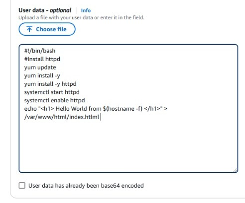

Agora clique em Launch instance. Clique no link verde que aparece, ou procure por EC2 novamente e vá até running instances.
Se você clicar na instancia, uma barra inferior com mais informações será mostrada, procure por IP público/public ipv4 address. Copie e cole em uma nova guia no browser:
Ela pode demorar um pouco, pois ainda deve estar inicializando.

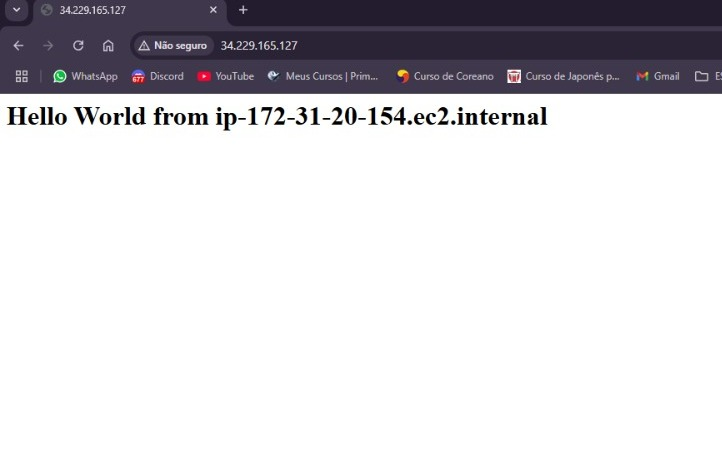

Conseguimos criar uma instancia e utilizar o User Data para instalar pacotes dentro dela.

Agora iremos deletar a nossa instancia, pois o próximo passo é iniciá-la com o docker e com o wordpress. Mas, se você não quiser deletá-la, podemos prosseguir fazendo apenas a edição do user data.

### Instaling docker compose

> `sudo curl -L \
https://github.com/docker/compose/releases/latest/download/docker-compose-$(uname -s)-$(uname -m) \ 
-o /usr/local/bin/docker-compose`

> `sudo chmod +x /usr/local/bin/docker-compose` > https://www.baeldung.com/ops/docker-compose-not-found

### Criando EC2 e usando o User data

- User data : é um setup bootstrap para configurar a ec2 durante a primeira launch(execução). Nessa etapa temos como objetivo rodar o container wordpress dentro da EC2.

Como que isso vai funcionar? Bom, primeiramente é importante entender que um container não possui comunicação com o mundo exterior e para que seja possível uma comunicação com ele/acessá-lo, devemos abrir uma de suas portas. Se criassemos um container na nossa máquina local, para acessá-lo, devemos expor uma de suas portas, e através do seu ip, podemos abrir a aplicação wordpress no browser:
Examplo:

> sudo docker run -d -p 8000:80 --name wordpress2 wordpress

O comando acima cria um container wordpress, roda ele como um processo daemon(no background) e expõe as portas desse container: `8000` é a porta que ficará exposta para a máquina acessá-lo no browser, localhost:8000 e `80` é a porta que o container está rodando dentro de si mesmo, seria como se fosse o seu localhost.

##### Pratica:

> docker run -d -p 8000:80 --name wordpress2 wordpress
> docker ps

###### browser: localhost:8000

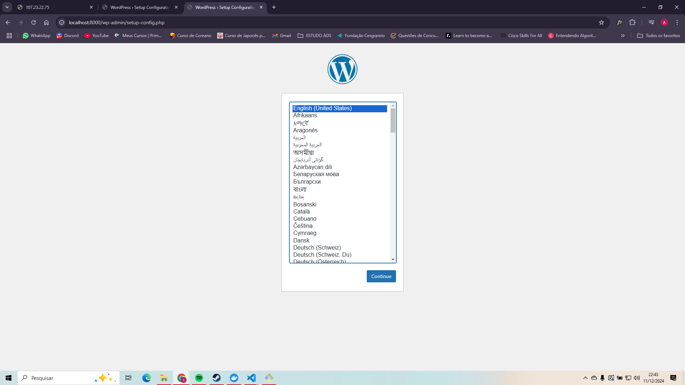

Agora, o nosso objetivo é rodar esse container dentro da EC2 e acessá-lo através do IP público da EC2.
Quando vamos criar a nossa instância, a colocamos em um Security Group, e nele podemos adicionar regras, as inbounds e outbound. Security Groups são como firewalls para a EC2 e controlam a entrada e saída de tráfico. Inbound rules controlam a entrada e Outbound as saídas de tráfico. Os clientes são considerados inbound quando acessam um site. Então para expormos o wordpress procisamos configurar uma regra inbound no security group com a mesma porta que o container está compartilhando sua aplicação, então a instancia vai escutar nessa porta e vai abrir esse canal para que outros também a escutem.

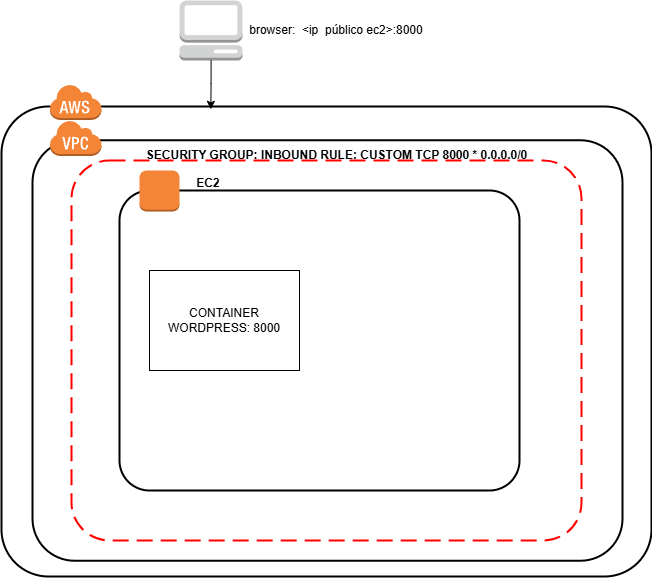

##### 1. Busque por security groups:

1.2 Create security group:

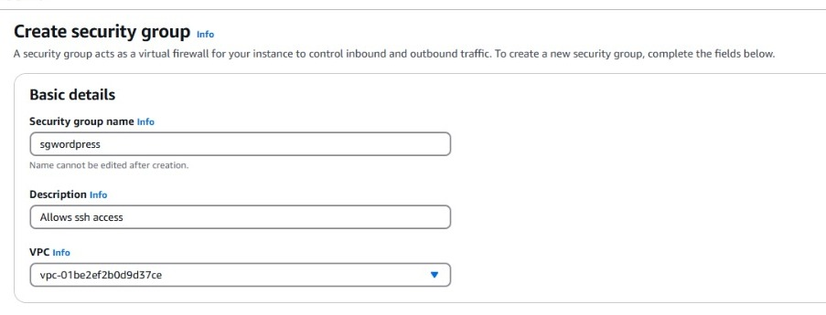
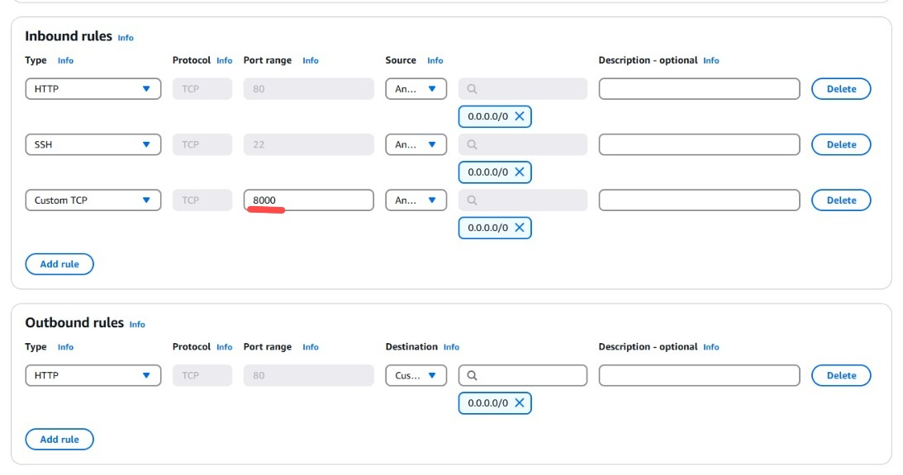

E clicar em criar grupo de segurança.

##### 2. Launch Instance

##### 2.1 Keypair :

2.1.1 Criar novo par de chave/key pair
2.1.2 Selecione RSA e .pem, crie a chave.
2.1.3 Ele irá fazer o download da chave, coloque-a na pasta do diretório que você está trabalhando no momento, pois ela deve estar no mesmo diretório ao fazer o login na instancia.

##### 2.2 Network Settings.

Clique em selecionar grupo de seguranaça existente e selecione o criado anteriormente.

##### 1.4 Advanced Details

##### 1.4.1 User data

Você pode criar um arquivo.sh e fazer o upload também, mas por motivos de aprendizado colocaremos manualmente.

```

#!/bin/bash
#Install httpd
yum install -y httpd git docker
systemctl enable httpd
systemctl start httpd
systemctl enable docker
systemctl start docker
docker run -d -p 8000:80 --name wordpress_app2 wordpress
```

Agora você pode clicar em criar instancia.

#### 2 Testando no browser:

Vá na instancia, clique na mesma, e um menu inferior aparecerá, na seção instance summary, copie o ipv4 público. Ou nas opções em cima da lista de instancias, no botão de Connect, clique nele e o ip público também estará presente, copie-o.
E cole no seu navegador.

`<ip público>:8000`

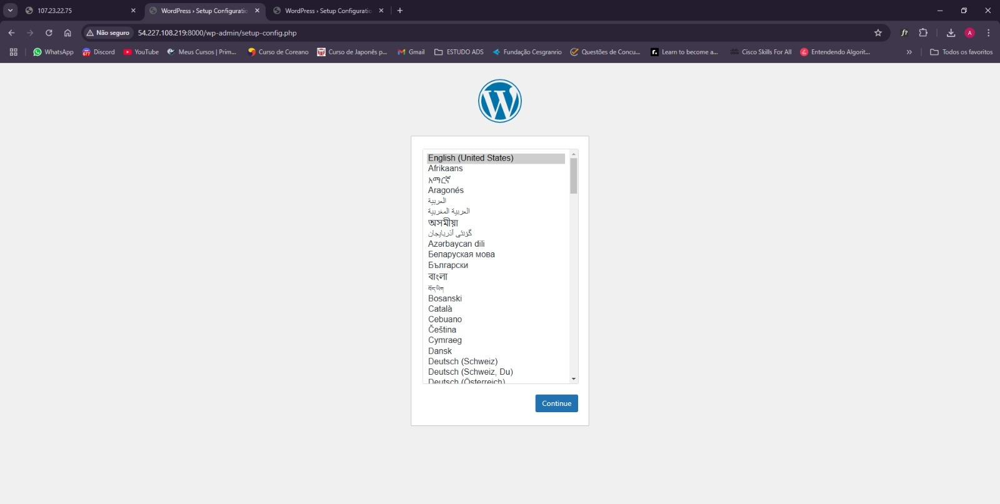

## Passo 6: Conectando a instancia EC2 a um banco de dados Mysql.

1. Criar grupos de segurança/security groups.
2. Criar RDS.
3. Criar ec2-1
4. Conectar ec2-1 ao RDS.
5. Criar ec2-2.
6. Testar conexão da ec2-2 com o RDS.

### 1 Criar grupo de segurança/security group.

#### 1.2 Security group do banco RDS.

- Especificações:
  Nome: rds-database-1
  Inbound rules: SSH(22);MYSQL/AURORA(3306)

Esse security group permitirá o acesso ssh/remoto e fará com que a comunicação com o banco seja na porta 3306 para todos. (Anywhere 0.0.0.0/0)

#### 1.3 Security group das EC2s.

- Especificações:
  Nome: ec2-sg
  Inbound rules:HTTP(80); SSH(22);Custom TCP (8080) Anywhere IPv4.

Esse security group permitirá o acesso ssh, e ficará com as portas 80 e 8080 para comunicação web.

### 2 Criar RDS.

- Especificações:
  Engine: Mysql; Templates: Free Tier; Settings.DB instance identifier: rds-database-1; Credentials settings: admin - MyNewPass1; Connectivity: Don´t connect to an EC2 compute resource. VPC security group. choose existing: rds-database-1. Additional configuration: backup (disable).

### 3 Criar ec2-1

- Especificações:
  Name: ec2-1; key pair; Security group : ec2-sg.

### 4 Conectar ec2-1 ao RDS.

- Instancia(ec2-1) > Networking > RDS database (selecione o banco criado - rds-database-1)

Copie o ip público da instância.

```
> ssh -i "suakeypair.pem" ec2-user@<ip instancia>
> sudo dnf install mariadb105 -y
> sudo mysql --version
```

Vá no seu RDS e copie o endpoint nos detalhes.

```
> sudo mysql -h <endpoint> -P 3306 -u admin -p
Password: MyNewPass1
mysql [none]> DROP DATABASE IF EXISTS wordpress;
mysql [none]> CREATE DATABASE wordpress;
mysql [none]> use wordpress;
mysql [wordpress]> CREATE TABLE users(
id integer primary key auto_increment,
name varchar(255) not null,
surname varchar(255) not null
);
mysql [wordpress]> INSERT INTO users(name, surname) values("Maria", "Josefina");
```

Agora, vá na sua vpc, detalhes e na seção de CIDRs, verifique o CIDR da vpc, por exemplo: 172.31.0.0.

```
mysql [wordpress]> CREATE USER 'maria'@'172.31.%.%' IDENTIFIED WITH mysql_native_password BY 'MyNewPass1';
```

O usuário maria só poderá ter acesso ao banco se estiver dentro da vpc.

```
mysql [wordpress]> GRANT ALL PRIVILEGES ON wordpress.* TO 'maria'@'172.31.%.%';
mysql [wordpress]> SELECT * FROM users;
```

Se tudo estiver certo até aqui, agoar podemos testar a conexão deste banco em outra máquina dentro da vpc.

### 5 Criar ec2-2.

- Crie outra ec2, no mesmo security group da anterior, apenas com o nome diferente, defina o nome para ec2-2.

Na instancia, após ser criada, conecte-a ao rds-database-1.

### 6 Testar conexão da ec2-2 com o RDS.

```
> ssh -i "suakeypair.pem" ec2-user@<ip instancia>
> sudo dnf install mariadb105 -y
> sudo mysql --version
> sudo mysql -h <endpoint> -P 3306 -u admin -p
Password: MyNewPass1
mysql [none]> use wordpress;
mysql [wordpress]> SELECT * FROM users;
```

Se isso funcionou, então as suas instancias conseguem chegar até o rds. Então conseguimos com sucesso conectar as EC2s ao RDS.

O nosso próximo passo é conectar uma instancia EC2 Wordpress com o banco RDS.
